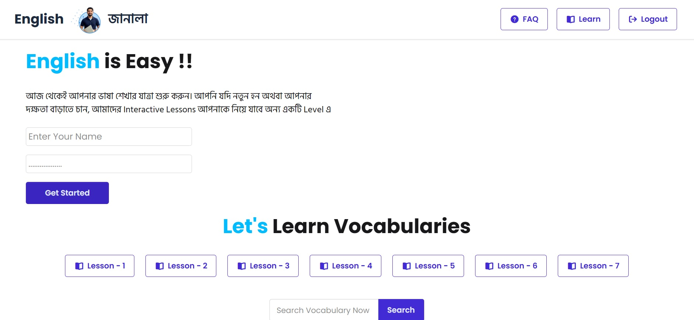

# 📚ENGLISH JANALA

A dynamic and interactive vocabulary learning application built with **React.js**. This tool helps users master new words through lesson-based levels, voice pronunciations, and a personalized "Saved Words" feature.

## 🔗 Project Links
- ***Live Demo:*** https://english-janala-dusky.vercel.app/

- ## 📸 Project Screenshot  



---

## 🧐 Project Overview
VocabMaster is designed to make language acquisition organized and engaging. Users can navigate through various difficulty levels, search for specific terms, and hear correct pronunciations using the Web Speech API. The application focuses on efficient data fetching from multiple APIs and provides a seamless, state-driven user interface.

---

## ✨ Key Features

* **Lesson-Based Navigation:** Dynamically generates lesson buttons from an API. Includes an **Active State** highlighter that changes the button color to show the currently selected level.
* **Interactive Word Cards:** Displays comprehensive word data including meanings, pronunciations, and synonyms. Uses a **Loading Spinner** to ensure a smooth UX during data fetching.
* **Voice Pronunciation:** Integrated **Web Speech API** allowing users to hear the correct pronunciation of any word by clicking a sound icon.
* **Search & Filter:** A real-time search input that filters vocabulary instantly. Performing a search automatically resets the active lesson button to maintain UI consistency.
* **Personalized Saved Box:** Users can click a **Heart Icon** to save specific words to a dedicated "Saved Words" section for quick review.
* **Detailed Modals:** A deep-dive view for each word that displays example sentences and synonyms, providing more context for the learner.

---

## 🛠️ Technologies Used

### **Languages & Core**
* **HTML5 (50.2%):** Semantic structure and SEO-friendly markup.
* **JavaScript (48.3%):** Core logic, API fetching, and dynamic DOM manipulation (ES6+).
* **CSS3 (1.5%):** Custom styling and layout refinements.

### **APIs & Features**
* **Web Speech API:** Powering the `pronounceWord` functionality for audio feedback.
* **REST APIs:** Integrated multiple API endpoints (Lessons, Vocabulary, and Details).

---

## ⚙️ Installation & Local Setup

To get a local copy up and running, follow these simple steps:

###  Prerequisites
Ensure you have **Node.js** and **npm** installed on your system.


1.  **Clone the repository:**
    ```bash
    git clone https://github.com/injamamulhoqtamim-bit/english-janala
    ```
2.  **Navigate to the project folder:**
    ```bash
    cd English-janala
    ```
3.  **Open the project:**
    * Simply open `index.html` in your browser.
    * *Recommended:* Use the **VS Code Live Server** extension for the best experience.

---
